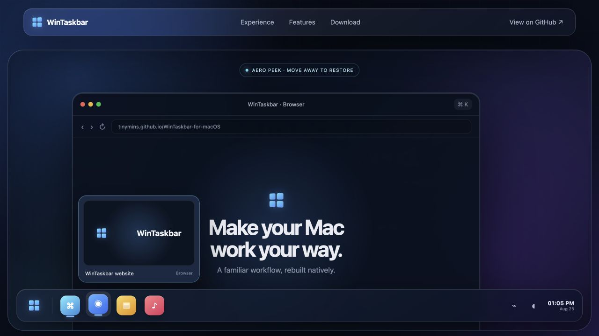
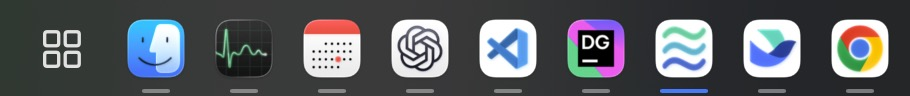
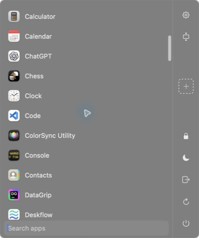

<div align="center">

# WinTaskbar for macOS

**Windows muscle memory. Native macOS speed.**

A native Windows-style taskbar, Start menu, window previews, and Aero Peek for macOS.

[](https://github.com/tinymins/WinTaskbar-for-macOS/releases)
[](https://github.com/tinymins/WinTaskbar-for-macOS/actions/workflows/release.yml)
[](https://github.com/tinymins/WinTaskbar-for-macOS/releases)
[](LICENSE)

[Try the interactive web demo](https://tinymins.github.io/WinTaskbar-for-macOS/) · [Download a release](https://github.com/tinymins/WinTaskbar-for-macOS/releases)



</div>

The website is a realistic, installation-free simulation of the design. Open Start, hover a taskbar app to reveal its window preview, then move into the preview to try Aero Peek. The macOS app itself is built natively with AppKit and SwiftUI.

## See it in action

| Native taskbar | Native Start menu |
|---|---|
|  |  |

## Features

- Borderless multi-display taskbar at the bottom, top, left, or right
- Pinned and running app merging, drag reorder, overflow, Dock badges, context menus, recent projects, and per-app shortcuts
- Window enumeration, hover previews, thumbnails, activation, minimization, Show Desktop, and taskbar-aware window fitting
- Searchable Start menu with custom folders, category grouping, drag-and-drop shortcuts, and power actions
- Interactive clock/calendar, battery, volume, Wi-Fi, and input-source tray controls
- Dock hiding and restoration, launch at login, global hotkeys, onboarding, and permission guidance
- Twelve bundled localizations, including Simplified Chinese

## Requirements

- macOS 13 or later
- Swift 6.2 or later

## Download

Each [GitHub Release](https://github.com/tinymins/WinTaskbar-for-macOS/releases) provides three builds. Most people should choose the universal package.

| Package | Mac type |
|---|---|
| `macos-arm64` | Apple Silicon Macs (M1 and newer) |
| `macos-x86_64` | Intel Macs |
| `macos-universal` | Both Apple Silicon and Intel Macs (recommended) |

Release archives use a stable self-signed certificate so macOS permission identity survives upgrades. They are not Apple-notarized, so first launch requires opening the app from the Finder context menu.

## Run from source

```bash
swift run WinTaskbar
```

## Build the macOS app

```bash
bash Scripts/package_app.sh
open dist/WinTaskbar.app
```

The generated app is ad-hoc signed for local use.

To preserve Accessibility and Screen Recording permissions across local rebuilds, use the same pinned signing identity as GitHub Actions:

```bash
bash Scripts/package_app_signed.sh
open dist/WinTaskbar.app
```

The signed build reads the encrypted certificate from `~/.config/wintaskbar/signing/WinTaskbar-CI-Code-Signing.p12` and its password from the login keychain item named `io.github.tinymins.WinTaskbar.ci-signing-p12`. Neither secret is stored in the repository. The certificate path, keychain service, and keychain account can be overridden with `WINTASKBAR_SIGNING_P12_PATH`, `WINTASKBAR_SIGNING_PASSWORD_SERVICE`, and `WINTASKBAR_SIGNING_PASSWORD_ACCOUNT`.

## Verification

```bash
bun run lint
bun run tsc
```

`bun run tsc` performs a full Swift build and runs the built-in defaults and persistence self-test without requiring a full Xcode installation.

See [FEATURES.md](FEATURES.md) for the item-by-item feature matrix.

## Automated releases

Pushing a semantic version tag such as `v0.0.1` builds, validates, and publishes the three architecture packages with SHA-256 checksum files. Tags with a prerelease suffix, such as `v0.0.2-rc.1`, are published as GitHub pre-releases. The same build matrix can be run without publishing from the Actions tab.

GitHub Actions requires these repository secrets for stable self-signing:

| Secret | Value |
|---|---|
| `MACOS_CERTIFICATE_BASE64` | Base64-encoded `.p12` containing the pinned code-signing certificate and its private key |
| `MACOS_CERTIFICATE_PASSWORD` | Password used when exporting the `.p12` |

The public certificate is pinned at `.github/WinTaskbar-CI-Code-Signing.pem`; Actions rejects a different certificate instead of silently changing the app's permission identity. Keep the encrypted `.p12` backed up because replacing the certificate or changing the bundle identifier requires users to grant macOS permissions again.

## Known limitations

- Wi-Fi SSID visibility can require Location permission on newer macOS versions.
- Accessibility, Screen Recording, and Automation features require the corresponding macOS permissions.

## License

WinTaskbar is released under the [MIT License](LICENSE).
