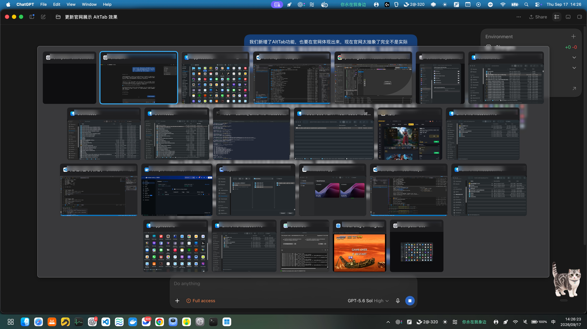
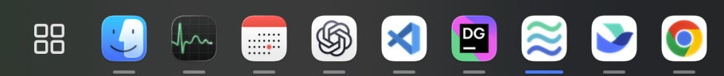
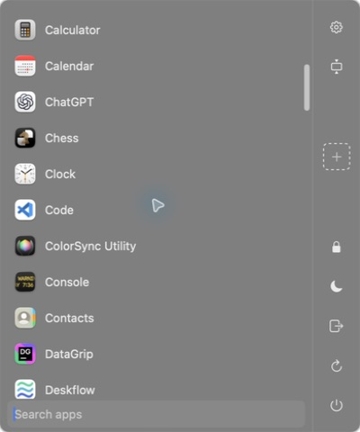

<div align="center">

# WinTaskbar for macOS

**Windows muscle memory. Native macOS speed.**

A native Windows-style taskbar, Start menu, Alt+Tab switcher, window previews, and Aero Peek for macOS.

[](https://github.com/tinymins/WinTaskbar-for-macOS/releases)
[](https://github.com/tinymins/WinTaskbar-for-macOS/actions/workflows/release.yml)
[](https://github.com/tinymins/WinTaskbar-for-macOS/releases)
[](LICENSE)

[Try the interactive web demo](https://tinymins.github.io/WinTaskbar-for-macOS/) · [Download a release](https://github.com/tinymins/WinTaskbar-for-macOS/releases)



</div>

The website uses captures from the running app in an installation-free interactive demo. Switch between the native taskbar, Start menu, and full-screen Alt+Tab view. The macOS app itself is built with AppKit and SwiftUI.

## See it in action

| Native taskbar | Native Start menu |
|---|---|
|  |  |

The full-screen Alt+Tab switcher uses live window thumbnails, recent-use ordering, forward and reverse cycling, and activates the selected window when the configured modifier is released.

## Features

- Borderless multi-display taskbar at the bottom, top, left, or right
- Pinned and running app merging, drag reorder, overflow, Dock badges, context menus, recent projects, and per-app shortcuts
- Window enumeration, hover previews, thumbnails, activation, minimization, Show Desktop, and taskbar-aware window fitting
- Windows-style Alt+Tab switching with live previews, recent-use ordering, and configurable Option, Command, or Control modifier
- Searchable Start menu with custom folders, category grouping, drag-and-drop shortcuts, and power actions
- Interactive clock/calendar, battery, volume, Wi-Fi, and input-source tray controls
- Dock hiding and restoration, launch at login, configurable Windows-style global shortcuts, onboarding, and permission guidance
- Rule-based desktop alerts: notification cards, central text, large text, colored screen-edge glow, countdowns, sound or speech, and an important-message list
- Twelve bundled localizations, including Simplified Chinese

## Desktop alerts

New or reset notification settings receive all system notifications by default: the fallback shows a bottom-right card and closes the matching original macOS notification. In Settings > Notifications, edit the fallback or add app-name/message-regex rules. Existing saved settings are preserved. The master switch enables notifications and all settings below it. Turning it off clears current alerts and disables editing and previews while preserving configuration; when enabled, use Preview to show a sample immediately. Rules use the first enabled match; each rule can combine several outputs. Disabling the card still allows the other outputs. The fixed fallback handles unmatched notifications.

Rules and the fallback can also enable **Automatically close original macOS notification**, independently of the output combination. It is enabled in the default fallback and remains optional for individual rules. A red warning appears when closing the original notification without showing a bottom-right card, including when the card display behavior is hidden. After capturing a matching notification, WinTaskbar rechecks its content and requests the close action on that single notification. The original banner may flash briefly, and closing it may also remove it from Notification Center. Groups, unrecognized layouts, and unavailable close actions are left alone; a status message reports unsuccessful attempts. Previews and countdown completion never close system notifications. Accessibility window/content change events request an immediate scan; a 750 ms timer covers missed or unsupported events. This reduces detection delay but is still capture-then-close, so it cannot guarantee a flash-free banner.

Each output has its own common settings and preview, including applicable color, duration, text, position, and size. Rules inherit these settings unless you customize that output for the rule. For example, set cards to disappear after 15 seconds by default, then customize the Feishu rule to keep its cards until dismissed. Output checkboxes select what a rule triggers; they are not global channel switches.

Important messages show an app icon and content until removed. Drag the important-message title bar to reposition the list. Its height rounds up from the configured default to the next complete message boundary, then scrolls; fewer messages shrink the list. Each update starts from that default, so the height never accumulates across updates. If a whole message would extend beyond the screen, the list uses the previous complete boundary (an oversized single message scrolls). Otherwise, the top stays in place as messages change unless the window needs to move to stay onscreen. The frame disappears when the list is empty. Messages, active countdowns, and alert history stay in memory and are cleared when WinTaskbar quits. Only rules and appearance/layout settings are saved.

Countdowns use a fixed duration or the seconds captured by group 1 of a regular expression. On expiry they can trigger another output combination. Templates accept `{app}`, `{title}`, `{body}`, and rule-regex groups such as `{1}`. With desktop alerts enabled, use the output preview buttons and layout editing to position sample overlays.

## Requirements

- macOS 13 or later
- Swift 6.2 or later

## Download

Each [GitHub Release](https://github.com/tinymins/WinTaskbar-for-macOS/releases) provides three builds. Most people should choose the universal package.

| Package | Mac type |
|---|---|
| `macos-arm64` | Apple Silicon Macs (M1 and newer) |
| `macos-x86_64` | Intel Macs |
| `macos-universal` | Both Apple Silicon and Intel Macs (recommended) |

Release archives use a stable self-signed certificate so macOS permission identity survives upgrades. They are not Apple-notarized, so first launch requires opening the app from the Finder context menu.

## Run from source

```bash
bun run init
swift run WinTaskbar
```

`bun run init` installs the pinned, checksum-verified `rcodesign` binary into the ignored `.tools/` directory. It does not import certificates or change the macOS keychain.

## Build the macOS app

```bash
bash Scripts/package_app.sh
open dist/WinTaskbar.app
```

The build automatically uses the same pinned identity as GitHub Actions when `.signing/WinTaskbar-CI-Code-Signing.p12` and `.signing/WinTaskbar-CI-Code-Signing.password` exist. Local signing reads those files directly through `rcodesign`; it does not import certificates or change the macOS keychain. The ignored `.signing/` directory must remain private because it contains both the encrypted certificate and its password. If neither file exists, the script falls back to ad-hoc signing. If signing material exists but `rcodesign` has not been initialized, the build fails with an instruction to run `bun run init`.

## Verification

```bash
bun run lint
bun run tsc
```

`bun run tsc` performs a full Swift build and runs the built-in defaults and persistence self-test without requiring a full Xcode installation.

The self-test also includes notification parsing and display-rule regressions using synthetic AX snapshots. To run only those checks without starting the app or reading system notifications:

```bash
swift run WinTaskbar --notification-self-test
```

See [FEATURES.md](FEATURES.md) for the item-by-item feature matrix.

## Automated releases

Pushing a semantic version tag such as `v0.0.1` builds, validates, and publishes the three architecture packages with SHA-256 checksum files. Tags with a prerelease suffix, such as `v0.0.2-rc.1`, are published as GitHub pre-releases. The same build matrix can be run without publishing from the Actions tab.

GitHub Actions requires these repository secrets for stable self-signing:

| Secret | Value |
|---|---|
| `MACOS_CERTIFICATE_BASE64` | Base64-encoded `.p12` containing the pinned code-signing certificate and its private key |
| `MACOS_CERTIFICATE_PASSWORD` | Password used when exporting the `.p12` |

The public certificate is pinned at `.github/WinTaskbar-CI-Code-Signing.pem`; Actions rejects a different certificate instead of silently changing the app's permission identity. Keep the encrypted `.p12` backed up because replacing the certificate or changing the bundle identifier requires users to grant macOS permissions again.

## Known limitations

- Wi-Fi SSID visibility can require Location permission on newer macOS versions.
- Accessibility, Screen Recording, and Automation features require the corresponding macOS permissions.

## License

WinTaskbar is released under the [MIT License](LICENSE).
